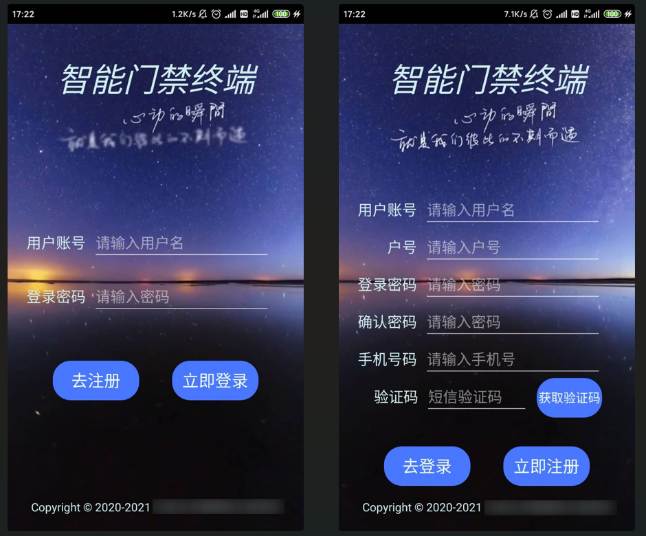
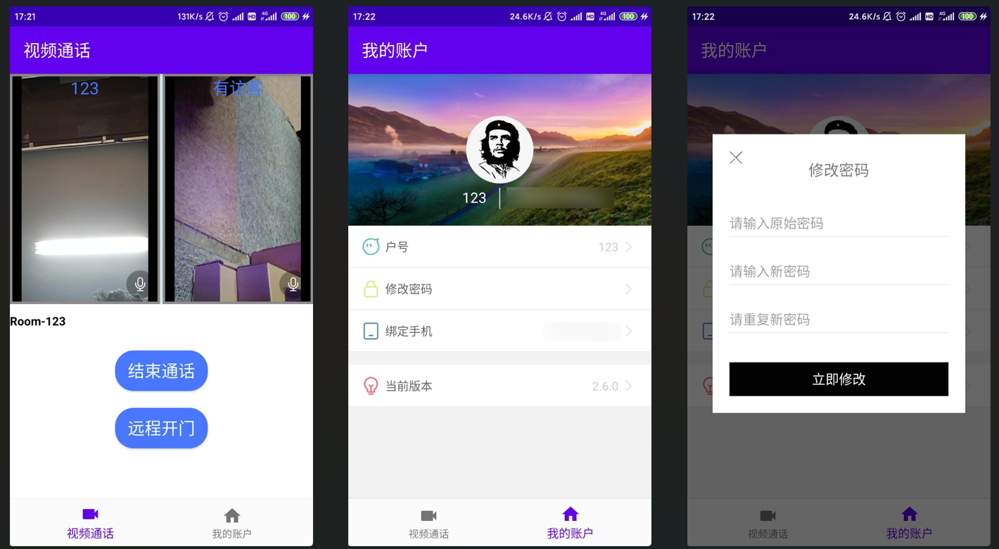

# SmartDoor_Client

智能门禁 | 用户移动端 | Android APP | 可视化门铃 | WebRTC | 视频通话 | 远程开门

## 应用特点

1. 用户注册及登录后端采用**Flask**框架，数据库为**Redis**，相关代码见[server/api.py](https://github.com/zys91/SmartDoor_Client/blob/main/server/api.py)，需自行配置参数；

2. 用户注册中手机号短信验证操作采用**MobSDK**，需自行申请API_Key进行配置，教程详见<http://www.mob.com/wiki/detailed?wiki=SMSSDK_for_Android_kuaisujicheng>；

3. 视频通话采用WebRTC技术，使用的是即构的**Express-Video SDK**进行搭建，教程详见<https://doc-zh.zego.im/article/5416>。

## 界面展示

## 注意事项

此仓库为智能门禁移动客户端(用户侧)，需与门禁设备终端配合食用，终端侧仓库[传送门](https://github.com/zys91/SmartDoor_Terminal)

